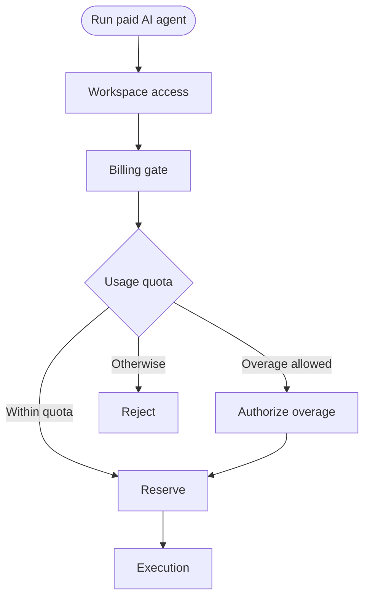

# Pathline

**Write complex backend operations as one readable flow — then run, test, trace, and diagram it.**

Pathline is a domain-agnostic TypeScript framework for modeling business logic top-down. You compose isolated operations into stages, guards, branches, parallel sections, loops, and compensations. The result is logic you can open in a single file and *understand* — plus a runtime that gives you cancellation, timeouts, retries, structured failures, traces, and diagrams for free.

```ts
const runPaidAgentFlow = flow<Ctx, Response>('Run paid AI agent')
  .stage('Request')
    .do(parseRequestBody)
    .do(authenticateUser)
  .stage('Billing gate')
    .do(loadPlan)
    .guard(subscriptionAllowsUsage)
    .branch('Usage quota', (b) =>
      b.when('Within quota', (c) => c.usage.used < c.usage.limit).goTo('Reserve usage')
       .when('Overage allowed', (c) => c.plan.allowsOverage).goTo('Authorize overage')
       .otherwise().goTo('Reject'))
  .stage('Execution')
    .do(runAgent)
  .onFailure()
    .do(releaseReservedUsage)
  .output((c) => c.response);
```

---

## The problem it solves

A single important endpoint — say "run a paid AI agent" — usually ends up smeared across a controller, three services, a couple of guards, a queue handler, some helpers, and a tangle of `try/catch`. To understand it you open eight files and reconstruct the order in your head. To test a single branch you boot the whole stack. When it fails in production you get a stack trace, not a business story.

Pathline pulls that operation into **one readable flow** (the *what*) backed by **isolated leaf operations** (the *how*). The flow file answers, at a glance:

1. What happens first? 2. What business checks exist? 3. Where does it branch? 4. What runs in parallel? 5. What happens on failure? 6. What does it return? 7. Which leaf do I open to debug?

## Before → after

<table>
<tr><th>Typical service method</th><th>Pathline flow</th></tr>
<tr><td>

```ts
async function runAgent(req) {
  const user = await auth.verify(req.token);
  if (!user) throw new Unauthorized();
  const ws = await wsSvc.find(req.wsId);
  if (!ws) throw new NotFound();
  const [member, sub, usage] = await Promise.all([
    memberSvc.find(ws.id, user.id),
    billing.sub(ws.id),
    usageSvc.get(ws.id),
  ]);
  if (!member) throw new Forbidden();
  const plan = await billing.plan(sub.planId);
  if (!plan.features.includes('agent'))
    throw new Forbidden('feature');
  let overage = false;
  if (usage.used >= usage.limit) {
    if (!plan.allowsOverage) throw new PaymentRequired();
    await billing.authorizeOverage(ws.id);
    overage = true;
  }
  const res = await usageSvc.reserve(ws.id);
  try {
    const out = await ai.run(req.body);
    // ...commit, audit, serialize...
  } catch (e) {
    await usageSvc.release(res.id); // easy to forget
    if (overage) await billing.void(ws.id);
    throw e;
  }
}
```

Order, gates, parallelism, and cleanup are all interleaved. Hard to scan; the rollback is one forgotten line away from a bug.

</td><td>

```ts
flow<Ctx, Res>('Run paid AI agent')
  .stage('Request')
    .do(authenticateUser)
  .stage('Workspace access')
    .do(loadWorkspace)
    .parallel('Load access data', (p) =>
      p.do(loadMembership)
       .do(loadSubscription)
       .do(loadUsage))
    .guard(userCanAccessWorkspace)
  .stage('Billing gate')
    .do(loadPlan)
    .guard(planIncludesAgentRuns)
    .branch('Usage quota', (b) =>
      b.when('Within quota', withinQuota).goTo('Reserve')
       .when('Overage allowed', allowsOverage)
         .goTo('Authorize overage')
       .otherwise().goTo('Reject'))
  .stage('Reserve').do(reserveUsage)
  .stage('Execution').do(runAgent)
  .onFailure()                 // always runs on failure
    .do(releaseReservedUsage)
    .do(voidOverageCharge)
  .output((c) => c.response);
```

The shape *is* the documentation. Compensation lives in one obvious place and can't be forgotten.

</td></tr>
</table>

## What you get for free

Because Pathline owns the execution model, every flow comes with capabilities you'd otherwise hand-roll per endpoint.

### A readable operation map — `flow.describe()`

```
Run paid AI agent (v1.0.0)

Request
  - Parse request body
  - Authenticate user
Workspace access
  - Load workspace
  - Parallel: Load access data
    - Load membership
    - Load subscription
    - Load usage
  - Guard: User can access workspace
Billing gate
  - Load plan
  - Guard: Plan includes AI agent runs
  - Branch: Usage quota
    - Within quota -> Reserve
    - Overage allowed -> Authorize overage
    - Otherwise -> Reject
On failure
  - Release reserved usage
  - Void overage charge
```

### Debugging by business step, not stack trace

`run()` never throws for business failures — it returns a structured result with a trace:

```ts
const result = await runPaidAgentFlow.run({ input });

result.ok;            // false
result.failureKind;   // 'guard_denied'  (machine-readable: timeout | cancelled | branch_unmatched | ...)
result.error;         // { code: 'FEATURE_NOT_INCLUDED', statusCode: 403, ... }
result.runId;         // 'run_…'  — correlate every log line for this execution
result.definitionHash;// match an old trace to the exact flow shape that ran
result.trace;         // ordered timeline of stages, guards, branches, retries, compensations
```

The trace shows the business path that executed and exactly where it stopped — including which branch was selected and which compensations ran.

For step-through debugging, break in operation handlers (not `.do()` calls) — see [debugging playbook](docs/adoption/debugging.md).

### Tests that read like the spec

Test one leaf in isolation, with no flow and no framework boot:

```ts
await loadWorkspace.run(ctx, { workspaceService });
expect(ctx.workspace).toEqual({ id: 'workspace-1' });
```

Or assert a whole business path against the trace (helpers work in Jest *or* Vitest):

```ts
const result = await buildRunPaidAgentFlow(mockDeps({ plan: basic })).run({ input });

expect(result.failureKind).toBe('guard_denied');
expect(hasFailedAt(result.trace, 'Plan includes AI agent runs')).toBe(true);
expect(hasRun(result.trace, 'Run agent')).toBe(false);             // never charged the AI provider
expect(hasRunCompensation(result.trace, 'Release reserved usage')).toBe(true);
```

### A diagram from the same definition — `flow.toMermaid()`



### Type-safe dependencies

Declare what a leaf uses and the compiler holds you to it — `deps` is narrowed to exactly the declared services, so reaching for an undeclared one is a **compile-time error** (and a dev-time warning catches *declared-but-unused* deps):

```ts
const loadSubscription = operation<Ctx, Deps>('Load subscription')
  .dependsOn('billingService')
  .writes('subscription')
  .handler(async (ctx, deps) => {
    ctx.subscription = await deps.billingService.find(ctx.workspace.id);
    // deps.authService  ← TypeScript error: not declared via dependsOn()
  });
```

`buildFlow(deps)` validates every declared dependency the moment you wire it, so missing services fail at construction — not mid-request.

## Production runtime, built in

| Capability | How |
| --- | --- |
| Cancellation | pass an `AbortSignal`; handlers receive it via `runtime.signal` |
| Per-operation timeout | `operation(...).timeoutMs(5000)` |
| Retries with backoff | `operation(...).retry({ attempts: 3, backoff: 'exponential', retryOn })` |
| Compensation (sagas) | `.onFailure()` runs best-effort rollback; original error preserved |
| Cleanup | `.finally()` always runs; cleanup errors kept separate from failures |
| Bounded loops | `.repeat(...)` with `maxAttempts` / `timeBudgetMs` / `stopWhen` |
| Concurrency | `.parallel(...).mode('failFast' \| 'collectAll').concurrency(n)` |
| Runaway guard | global `maxSteps` ceiling (`goTo` stays acyclic; loops use `repeat`) |
| Redaction | `flow.redact()` / `operation.redactTrace()` — no secrets in traces by default |
| Observability | lifecycle hooks + `onTrace`; OpenTelemetry-compatible event shape |
| Startup validation | `FlowRegistry.validateAll({ strict })` fails fast on broken flows |

## The two layers

**Flow root — the readable business map.** Stages, guards, branches, parallel, repeat, subflow, onFailure, finally, output.

**Leaf operations — isolated and testable.**

```ts
export const loadWorkspace = operation<Ctx, Deps>('Load workspace')
  .dependsOn('workspaceService')
  .writes('workspace')
  .handler(async (ctx, deps) => {
    const workspace = await deps.workspaceService.findById(ctx.input.workspaceId);
    if (!workspace) {
      throw new FlowHttpError({ statusCode: 404, code: 'WORKSPACE_NOT_FOUND', message: 'Workspace not found' });
    }
    return { workspace };
  });
```

The flow says *what* happens. The operation says *how* one step works. Each is replaceable and unit-testable on its own.

## Limits & composition

Pathline v1 is **in-process** — it orchestrates within a single request or job invocation, not across process restarts.

- A flow runs in one process. If a Lambda times out or a container restarts mid-flow, state is lost and `.onFailure()` compensations do **not** run.
- Pathline is **not** a replacement for Temporal, Inngest, or AWS Step Functions.

**Recommended pattern:** let a durable queue or job runner own survival across crashes; let Pathline own readable business logic inside each invocation:

```
SQS / BullMQ / Inngest job → runPaidAgentFlow.run(ctx) → idempotent side effects
```

Make externally-visible effects [idempotent](docs/adoption/idempotency.md). For events and webhooks, use a [transactional outbox](docs/adoption/transactional-outbox.md). Details: [durable vs in-process](docs/adoption/durable-vs-in-process.md).

## What Pathline is not

- Not a NestJS replacement, a visual editor, a graph-exporter, or a rules engine. It's a way to author and run real application operations in plain TypeScript.

## Packages

| Package | Description |
| --- | --- |
| [`@pathline/core`](packages/core) | Authoring API, runtime, tracing, validation, graph/describe. |
| [`@pathline/nestjs`](packages/nestjs) | Thin NestJS adapter (module, `FlowRunner`, exception filter, trace interceptor). |

## Install

```bash
pnpm add @pathline/core
pnpm add @pathline/nestjs   # optional NestJS adapter
```

## Compatibility

- Node.js: 18, 20, 22 · TypeScript: 5.x · NestJS: 10.x / 11.x · ESM + CJS

## Development

```bash
pnpm install
pnpm build          # all packages (tsup, dual ESM/CJS + d.ts)
pnpm test           # vitest
pnpm test:coverage
pnpm bench          # runtime-overhead sanity benchmarks
```

## Documentation

- [Getting started](docs/getting-started.md) · [Concepts](docs/concepts.md) · [NestJS](docs/nestjs.md) · [Testing](docs/testing.md) · [Tracing](docs/tracing.md) · [Visualization](docs/visualization.md)
- RFC: [context type safety](docs/rfc/context-type-safety.md)
- Adoption: [migrating an existing service](docs/adoption/migrating-existing-service.md) · [when not to use Pathline](docs/adoption/when-not-to-use-pathline.md) · [production checklist](docs/adoption/production-checklist.md) · [debugging](docs/adoption/debugging.md) · [Nest request scope](docs/adoption/nest-request-scope.md) · [error handling](docs/adoption/error-handling.md) · [observability](docs/adoption/observability.md) · [security & redaction](docs/adoption/security-redaction.md) · [durable vs in-process](docs/adoption/durable-vs-in-process.md) · [transactions & side effects](docs/adoption/transactions-and-side-effects.md) · [idempotency](docs/adoption/idempotency.md) · [transactional outbox](docs/adoption/transactional-outbox.md)

## License

MIT
