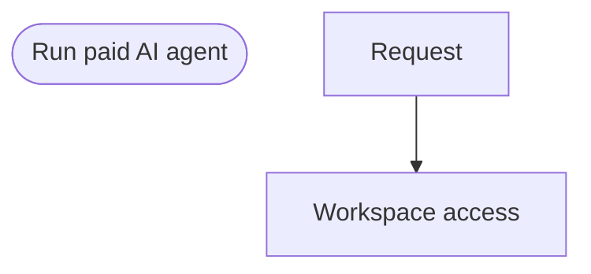

# Visualization

Visualization is secondary but built in: it follows naturally from the internal model.

## describe()

Returns a human-readable, indented operation map:

```
Run paid AI agent (v1.0.0)

Request
  - Parse request body
  - Authenticate user

Workspace access
  - Parallel: Load access data
    - Load membership
    - Load subscription
    - Load usage
  - Guard: User can access workspace

Billing gate
  - Branch: Usage quota
    - Within included quota -> Reserve usage
    - Overage allowed -> Authorize overage
    - Otherwise -> Reject quota exceeded

On failure
  - Release reserved usage
```

Repeat blocks render their bounds (`Max attempts`, `Time budget`, `Stop when`).

## toGraph()

Returns a domain-neutral `FlowGraph` of `nodes` and `edges`. Node kinds include `flow`, `stage`, `operation`, `guard`, `branch`, `parallel`, `repeat`, `subflow`, `compensation`, `finally`, `output`, `failure`.

```ts
const graph = flow.toGraph();
```

## toMermaid()

Renders a Mermaid `flowchart TD` (stages as boxes, branches as diamonds, labeled edges for branch cases and goto jumps):

```ts
console.log(flow.toMermaid());
```



No secrets appear in `describe()`, `toGraph()`, or `toMermaid()` - they render structure (names/ids), not context values.
